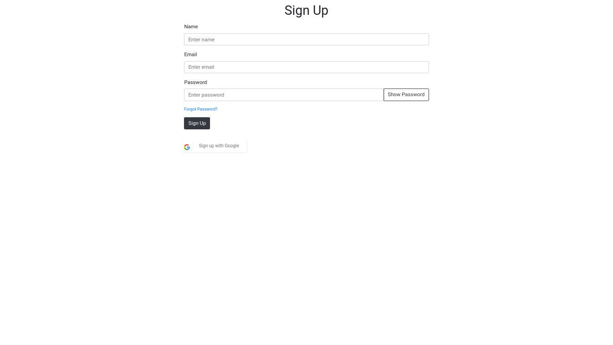
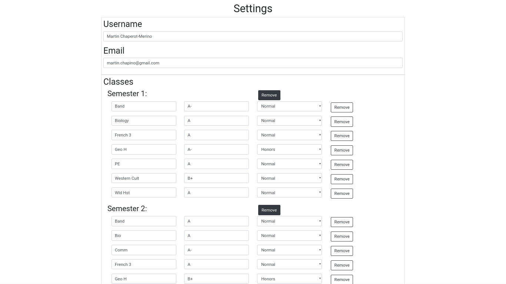
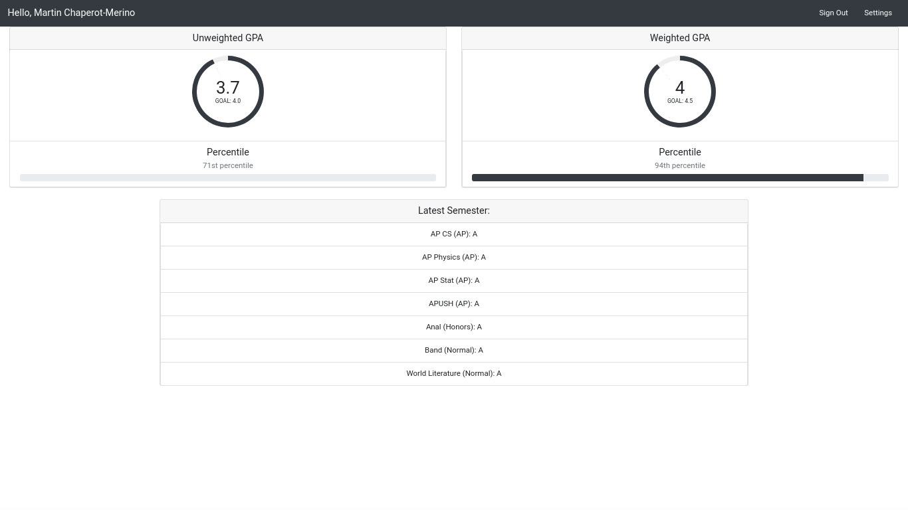
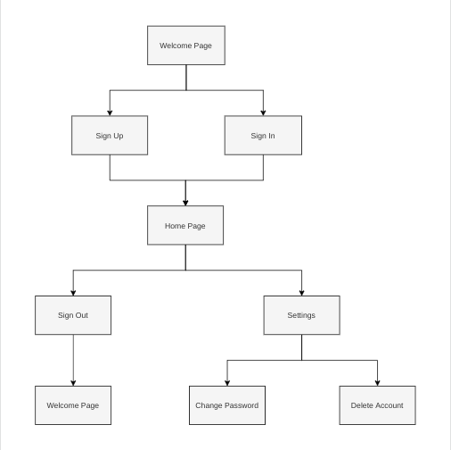

# GPA-Calculation-Website
Its a website that lets you calculate your gpa!

# How to use

Go the the website URL: [http://www.gpac.tk/](http://www.gpac.tk/)

1. Create an account 

2. Enter your grades in the settings page

3. View your unweighted GPA and weighted GPA in the home page

# How it works

## Here are the building blocks:

1. Front end: HTML / Javascript / Bootstrap
2. Backend: None (all front end calculations)
3. Database: Firebase

## User flows:

## Why Firebase?

To have a fully serverless app.  No server means faster load time. And it is free!
